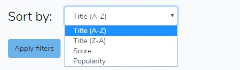

The following project is based on laravel. 
So far, the main and only functionality is browsing anime tv shows from current season (at the time of latest commit, it's winter 2019/2020). The user can sort displayed titles by names, score or popularity (as shown on screen below) as well as browse descriptions and create personalised list of favourite shows, by choosing 'follow' option on the description page, to track the next episode date. The list is accesible after creating an account and is stored in the database. The API that is beeing used for fetching data:
- https://jikan.docs.apiary.io/ 

# Main page

# Sorting options

# Sortation results

# Single show description

# Main page with followed shows
